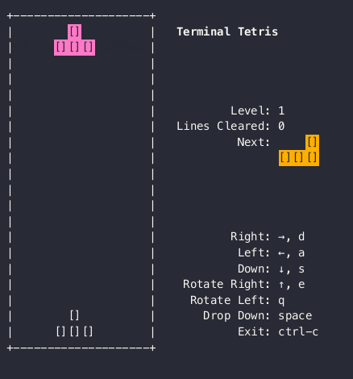

# Terminal Tetris

  

Play Tetris from the comfort of your terminal!



⚠️ this assumes you know how to use the terminal! If you don't you can find out how [here](https://www.google.com/search?q=how+to+use+the+terminal).

## Install

For Apple computers with ARM chips you can use the provided installer. For any other OS you'll have to compile the binary yourself.

### ARM (Apple Silicon)

Open the terminal and run:

```bash
curl -sSL https://raw.githubusercontent.com/Alvaroalonsobabbel/tetris/main/bin/install.sh | bash
```

- You'll be required to enter your admin password.
- You might be required to allow the program to run in the _System Settings - Privavacy & Security_ tab.

### Compiling the binary yourself

1. [Install Go](https://go.dev/doc/install)
2. Clone the repo `git clone git@github.com:Alvaroalonsobabbel/tetris.git`
3. CD into the repo `cd tetris`
4. Run the program `make run-tetris`

## Multiplyer

Yes, Terminal Tetris allows you to battle your way out against another person! Every time you complete a line, the opponent's speed will increase by one level, creating a fast-paced multiplayer experience.

Tetris server is a minimalistic server implementation that uses gRPC bidirectional streaming to allow clients to play tetris against each other.

### Connect to my own server (while it last)
```bash
tetris -address="52.50.114.171" -name="your_name"
```
### Create your own server

You can either run the server in your local host:
```bash
make run-server
```

Or you can run it inside of a container:
```bash
make docker-build
```

The server will listen to TCP connections over the port *9000*. How to expose the port for others to join you locally is beyond the scope of this document. However you can look at tools like [ngrok](https://ngrok.com/).

## Options

Disables Ghost piece.

```bash
tetris -noghost
```

Enables debug logs into `~/.tetrisLog`.

```bash
tetris -debug
```

Prints current version.

```bash
tetris -version
```

Sets player's name for Online mode.

```bash
tetris -name="YOUR_NAME"
```

Sets the server address for Online mode.

```bash
tetris -address="YOUR_SERVER_ADDRESS"
```
